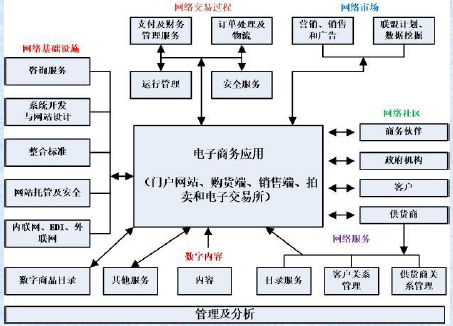

# Part4 电子商务支持服务

## 基础概念

大多数电子商务应用需要支持服务，如：

- 安全服务
- 支付服务
- 基础设施及技术服务
- 订单实施和物流服务

大多数服务与 B2C 、 B2B相关

## 订单实施与物流

### 电子商务与实体商务的区别（以零售为例）：

电子商务基于“拉”式运作理念，即整个过程始于订单

- 客户定制订单，需求较难预测：
- 缺乏经验&消费者潜在需求不断变化
- 小订单需要整合，然后送货上门

实体商务基于“推”式思路，即从生产 库存 →→“推”向客户

- 商品首先大量运输到零售店，然后由客户自己提货

### 订单实施

定义：按时给客户提供其订购的商品，同时提供相关的客户服
务

目标：以合适的成本，在正确的时间，把正确的商品和服务运送至正确的 地点。

订单实施包括前台运作和后台运作

- 后台运作：主要指支持订单实施的活动，如包装、配送、会计、存货管理和运输等；一般客户不 可见。
- 前台运作：面向客户的活动，如广告、接单等；一般客户可见

过程：产品咨询、销售报价、订单配置、订单安排、订单确认、订单计划、订单变更、装运实施、装运、递交、结算、退货

### 物流

定义为了确保消费者的需求，对商品、服务以及相关信息从来源地到消费地的流动和存储进行积极有效的计划、执行和控制的过程

该定义包括了出库、入库、内部运转、外部运转，以及商品和服务的退回等多个环节，也包括订单实施。

物流和订单实施的差异并不显著

- **传统物流**将大量货物运送到较少的目的地（如零售店）
- **电子商务物流**将少量货物运送至众多目的地（如客户的家或客户指定的目的地）

## 典型问题与应对

### 问题

- 无论在线还是离线销售， 典型 问题 是 不能按时送货
- 高库存
- 配送出错
- 高供应链操作成本
- 电子商务模式下，库存水平不合适、送货和运输计划混乱
- 需求预测困难

原因：不确定性、低效财务和信息共享

供应链管理中的核心问题：分销网络构建、存货管理、供货合同、分销战略、战略伙伴、外包和采购、产品设计、信息技术、以及客户 价值

### 应对

#### 改进订单实施过程

- 订单接收电子化、自动化
- 自动产生订单，并自动传送给供货商
- 电子支付
- 数据集成

#### 改进仓储和存货管理

- 仓储管理采用自动化设备和 软件
- 改进存货管理

#### 改变供应链结构和流程

线性供应链结构 中心结构

#### 改进物流

- 加速配送
- 物流合作与物流外包
- 按订单生产
- 优化退换货（外包、集散地）

#### 风险管理

- 合理预估风险
- 增强流程可视化

